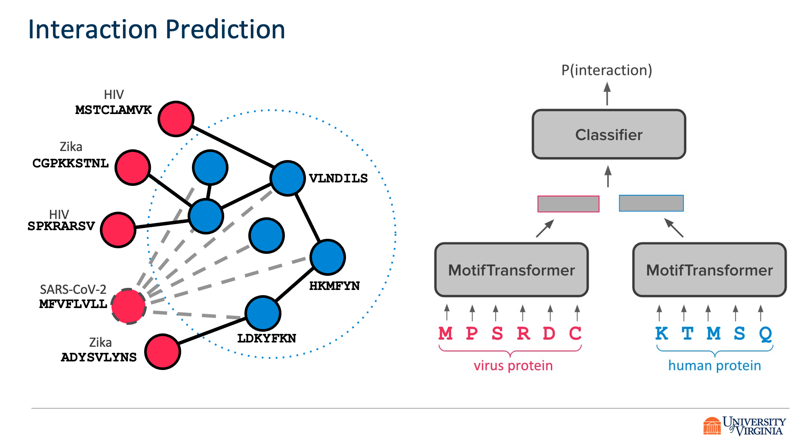
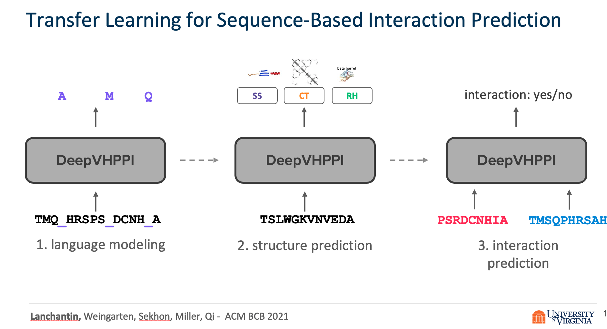
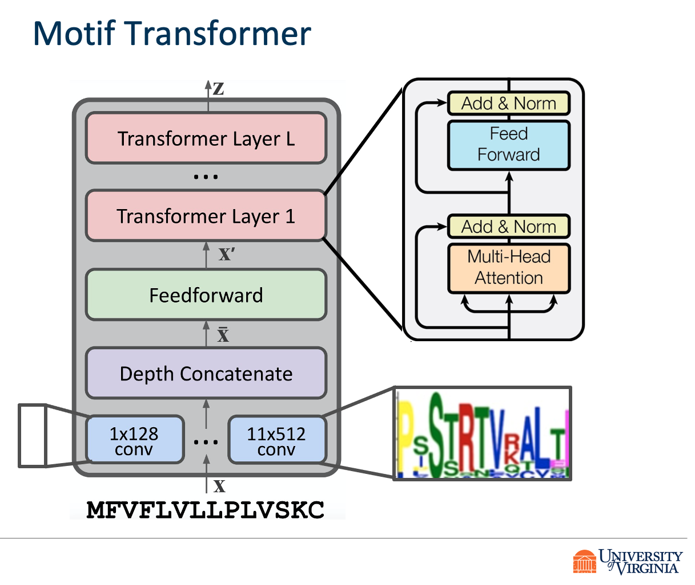

### Title: Transfer Learning for Predicting Virus-Host Protein Interactions for Novel Virus Sequences

+ authors: Jack Lanchantin, Tom Weingarten, Arshdeep Sekhon, Clint Miller, Yanjun Qi
+ 2021 ACM Conference on Bioinformatics, Computational Biology, and Health Informatics (ACM BCB)


### PDF

- @[BioArxiv](https://www.biorxiv.org/content/10.1101/2020.12.14.422772v2)
- @[ACM](https://dl.acm.org/doi/abs/10.1145/3459930.3469527)
- GitHub [https://github.com/QData/DeepVHPPI](https://github.com/QData/DeepVHPPI)


### Talk: [Slide](https://docs.google.com/presentation/d/1LfSVsZ2hSy7F-AVXt1WIUfT2Qsw-db7VITZhmifAniQ/edit)


### Abstract

Viruses such as SARS-CoV-2 infect the human body by forming interactions between virus proteins and human proteins. However, experimental methods to find protein interactions are inadequate: large scale experiments are noisy, and small scale experiments are slow and expensive. Inspired by the recent successes of deep neural networks, we hypothesize that deep learning methods are well-positioned to aid and augment biological experiments, hoping to help identify more accurate virus-host protein interaction maps. Moreover, computational methods can quickly adapt to predict how virus mutations change protein interactions with the host proteins.

We propose DeepVHPPI, a novel deep learning framework combining a self-attention-based transformer architecture and a transfer learning training strategy to predict interactions between human proteins and virus proteins that have novel sequence patterns. We show that our approach outperforms the state-of-the-art methods significantly in predicting Virus–Human protein interactions for SARS-CoV-2, H1N1, and Ebola. In addition, we demonstrate how our framework can be used to predict and interpret the interactions of mutated SARS-CoV-2 Spike protein sequences.

We make all of our data and code available on GitHub [https://github.com/QData/DeepVHPPI](https://github.com/QData/DeepVHPPI).







### Citations

```
@article {Lanchantin2020.12.14.422772,
	author = {Lanchantin, Jack and Weingarten, Tom and Sekhon, Arshdeep and Miller, Clint and Qi, Yanjun},
	title = {Transfer Learning for Predicting Virus-Host Protein Interactions for Novel Virus Sequences},
	elocation-id = {2020.12.14.422772},
	year = {2021},
	doi = {10.1101/2020.12.14.422772},
	publisher = {Cold Spring Harbor Laboratory},
	abstract = {Viruses such as SARS-CoV-2 infect the human body by forming interactions between virus proteins and human proteins. However, experimental methods to find protein interactions are inadequate: large scale experiments are noisy, and small scale experiments are slow and expensive. Inspired by the recent successes of deep neural networks, we hypothesize that deep learning methods are well-positioned to aid and augment biological experiments, hoping to help identify more accurate virus-host protein interaction maps. Moreover, computational methods can quickly adapt to predict how virus mutations change protein interactions with the host proteins.We propose DeepVHPPI, a novel deep learning framework combining a self-attention-based transformer architecture and a transfer learning training strategy to predict interactions between human proteins and virus proteins that have novel sequence patterns. We show that our approach outperforms the state-of-the-art methods significantly in predicting Virus{\textendash}Human protein interactions for SARS-CoV-2, H1N1, and Ebola. In addition, we demonstrate how our framework can be used to predict and interpret the interactions of mutated SARS-CoV-2 Spike protein sequences.Availability We make all of our data and code available on GitHub https://github.com/QData/DeepVHPPI.ACM Reference Format Jack Lanchantin, Tom Weingarten, Arshdeep Sekhon, Clint Miller, and Yanjun Qi. 2021. Transfer Learning for Predicting Virus-Host Protein Interactions for Novel Virus Sequences. In Proceedings of ACM Conference (ACM-BCB). ACM, New York, NY, USA, 10 pages. https://doi.org/??Competing Interest StatementThe authors have declared no competing interest.},
	URL = {https://www.biorxiv.org/content/early/2021/06/08/2020.12.14.422772},
	eprint = {https://www.biorxiv.org/content/early/2021/06/08/2020.12.14.422772.full.pdf},
	journal = {bioRxiv}
}

```

# How to run the code 

**SARS-CoV-2 PPI**
CUDA_VISIBLE_DEVICES=0,1,2,3 python main.py --data_root ./data/data/ -tr yang_ppi/train.json -va yang_ppi/test.json -te  HVPPI/test.json -v vocab.data -s 1024 -hs 512 -l 12  -o results  --lr 0.00001 --dropout 0.1 --epochs 200 --attn_heads 8 --activation 'gelu' --task biogrid  --emb_type 'conv' --overwrite  --batch_size 4 --grad_ac_steps 4

**ZHOU PPI**
CUDA_VISIBLE_DEVICES=0,1,2,3 python main.py --data_root ./data/data/ -tr zhou_ppi/h1n1/human/train.json  -va zhou_ppi/h1n1/human/test.json -v vocab.data -s 1024 -hs 512 -l 12  -o results --lr 0.00001 --dropout 0.1 --epochs 20000 --attn_heads 8 --activation 'gelu' --task ppi --emb_type 'conv' --overwrite  --batch_size 8 --grad_ac_steps 2 --name '' 

**BARMAN PPI**
CUDA_VISIBLE_DEVICES=0,1,2,3 python main.py --data_root ./data/data/ -tr barman_ppi/train1.json  -va barman_ppi/test1.json -v vocab.data -s 1600 -hs 512 -l 12  -o results  --lr 0.00001 --dropout 0.1 --epochs 200 --attn_heads 8 --activation 'gelu' --task ppi  --emb_type 'conv' --overwrite  --batch_size 4 --grad_ac_steps 4

**DeNovo SLIM PPI**
CUDA_VISIBLE_DEVICES=0,1,2,3 python main.py --data_root ./data/data/ -tr DeNovo/train.json  -va DeNovo/test.json -v vocab.data -s 1024 -hs 512 -l 12  -o results --lr 0.00001 --dropout 0.1 --epochs 20000 --attn_heads 8 --activation 'gelu' --task ppi --emb_type 'conv' --overwrite  --batch_size 8 --grad_ac_steps 2 --name '' --saved_bert ./results/multi.bert.bsz_16.layers_12.size_512.heads_8.drop_10.lr_1e-05.saved_bert.torch/best_model.pt


### Support or Contact

Having trouble with our tools? Please [contact Jack](mailto:jacklanchantin@gmail.com) and we’ll help you sort it out.
